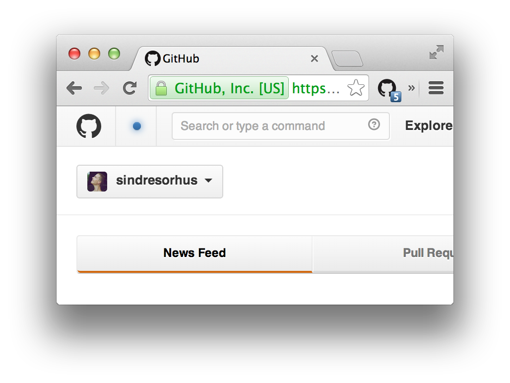
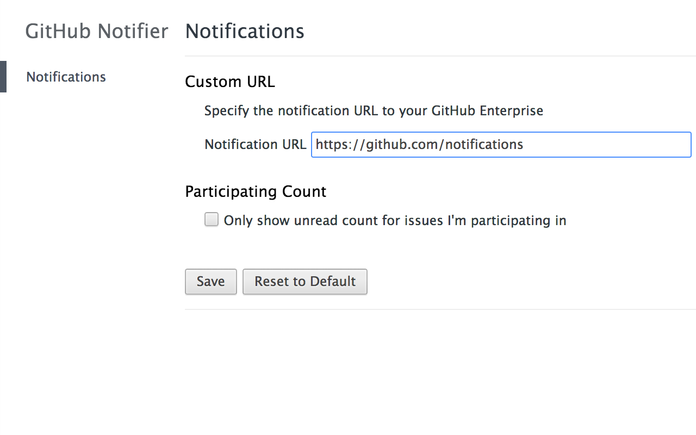
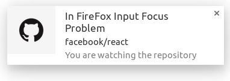

# Notifier for GitHub 

> Chrome extension - Displays your GitHub notifications unread count

It checks for new GitHub notifications every minute.

## Highlights

- Desktop notifications
- Option to show only unread count for issues you're participating in
- GitHub Enterprise support

*Make sure to add a token in the options.*

## Install

- [Chrome extension](https://chrome.google.com/webstore/detail/notifier-for-github/lmjdlojahmbbcodnpecnjnmlddbkjhnn)
- [Opera add-on](https://addons.opera.com/en/extensions/details/github-notifier/)

## Permissions

Both requested permissions are optional, so you can just decline if you don't want it.

#### Tabs permission

The first time you click on the extension icon, it will ask you for access to browser tabs. We need this to know if there is already an opened GitHub notifications page and switch to it if so.

#### Notifications permission

If you want to receive desktop notifications for public repositories, you can enable them on extension options page. You will then be asked for the notifications permission.

#### Repos permission

If you want to receive (useful) desktop notifications for any private repositories you have, you will be asked for the repo permission as well. This is due to GitHub's current permission scheme, as the only way we can read anything about your private repos is if we have full control over them. If you're concerned with your security in this manner please feel free to not give this permission, just be aware that if you do not enable this permission, clicking on the notification will take you to the notifications home page since we can't get any information about the repo you got the notification for.

## Desktop notifications

You can opt-in to receive desktop notifications for new notifications on GitHub. The extension checks for new notifications every minute, and displays notifications that arrived after the last check if there are any. Clicking on the notification opens it on GitHub.

## Related

Also available on [Firefox](https://github.com/sindresorhus/notifier-for-github-firefox) and [Safari](https://github.com/sindresorhus/notifier-for-github-safari).

## Maintainers

- [@YurySolovyov](https://github.com/YurySolovyov) (Yury Solovyov)
- [@gcochard](https://github.com/gcochard) (Greg Cochard)
- [@fstoerkle](https://github.com/fstoerkle) (Florian Störkle)
- [@jacobbearden](https://github.com/jacobbearden) (Jacob Bearden)

## License

MIT © [Sindre Sorhus](https://sindresorhus.com)
